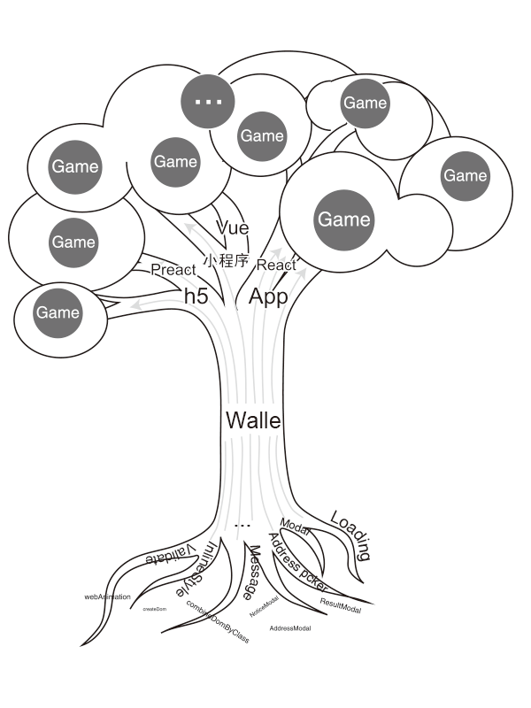
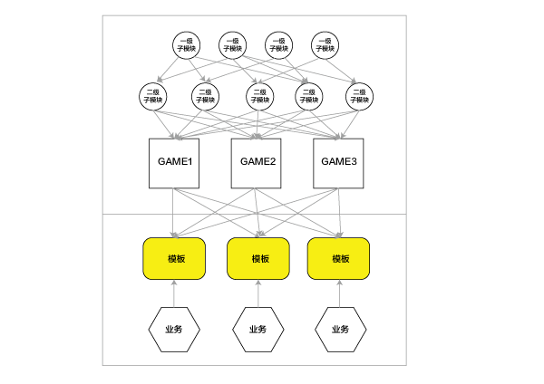

# Introduction
venom 是抽奖活动模块化的一套前端方案；

1、当前端框架日新月异，新技术层出，宿主环境千变万化，项目需要迎合这些变化（小程序，公众号，app,  h5, ...）一个都不能少，受限于框架或宿主环境的变动，如果计划不周到一套代码很难复用到各个端，于是我们不断的重复造轮子，造成资源的极大浪费。其实回归到本质，虽然环境千变万化，框架层出不穷但对于前端客户端来说万物皆“JavaScript”与“浏览器”，所以我们**采用最纯粹的JavaScript和HTML node去面向对象封装**，这样任何框架只要存在浏览器宿主就都可以灵活的使用venom

2、抽奖活动对于以会员运营为主的公司或部门来说，无疑是一个高频次的互动活动，当相同或者相似项目在重复开发的时候，我们就需要认真思考项目的可复用性了。

分析抽奖

#### 模式统一

活动对于前端来说 

1. 抽奖形式。
2. 抽奖。
3. 中奖，未中奖。
4. 领奖。

依此我们乐高似的抽象各个模块；

#### 形式多样

抽奖活动在UI和形式上是非常个性化的，所以venom提供的模块都设计了灵活的样式定制属性

### 与业务的结合

业务与模块通过模板握手，实现高度复用

[Get started ->](./venom/getstarted.md)
