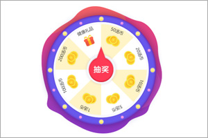
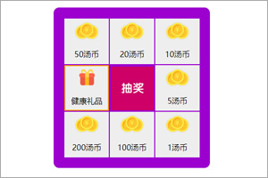
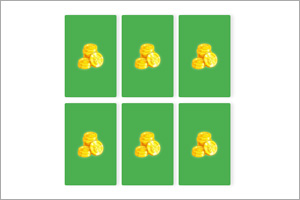
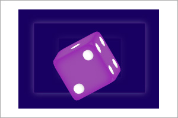

### Get started

#### 安装（通用于后面所有模块）

**npm安装**

```ssh
npm install @byhealth/lottery
```

javascript:

```javascript
import { Game } from '@byhealth/lottery/dist/lib/roulette';
const game = new Game({...游戏参数});
```

**cnd安装**

> 脚本暂未放置cdn，请自行下载放置

```html
<script src="./node_modules/@byhealth/lottery/dist/lib/roulette.js"></script>
```

构造方法与工具将暴露于 window.\_\_\_Lottery\_\_\_下

javascript:

```javascript
const game = new window.___Lottery___.roulette.Game({...游戏参数})
```


#### Usage ：

```javascript
import { Game } from '@byhealth/lottery/lib/roulette'; 

const LotteryGame = new Game({
          targetId,
          parentId,
          playerPhone,
          cardIdRequest: 3, 
          style,
    	  // 抽奖Api
          start: () => new Promise((resolve) => {
                resolve(prize)
            }),
    	  // 保存收货地址Api
          saveAddress: data => {
              console.log('保存收货地址')
          },
          receiverInfo,
    	  // 验证手机验证码Api
          checkVerificationCode: data => new Promise((resolve) => {
            }),
          prizes,
          emBase: 10,
          onCancel: () => console.log('关闭中奖结果callback'),
          onEnsure: (prize) => console.log('确定中奖结果callback！', prize),
    	  // Loading加载动画配置
          loading: {
            size: 20,
            length: 5,
            cycleTime: 1
          }
    });
```


#### example：

<div style="width:100%; clear:both">
	<div style="float: left; width: 33%; text-align:center">
        <a href="https://by-healthfed.github.io/venom/dist/demo/roulette.html"></a>
        <div style="text-align:center; padding:10px 0">大转盘(roulette)</div>
    </div>
    <div style="float: left; width: 33%; text-align:center">
        <a href="https://by-healthfed.github.io/venom/dist/demo/boxroulette.html"></a>
        <div style="text-align:center; padding:10px 0">九宫格(boxroulette)</div>
    </div>
    <div style="float: left; width: 33%; text-align:center">
        <a href="https://by-healthfed.github.io/venom/dist/demo/flipcard.html"></a>
        <div style="text-align:center; padding:10px 0">翻牌(flipcard)</div>
    </div>
    <div style="float: left; width: 33%; text-align:center">
        <a href="https://by-healthfed.github.io/venom/dist/demo/dice.html"></a>
        <div style="text-align:center; padding:10px 0">掷色子(dice)</div>
    </div>
    <div style="float: left; width: 33%; text-align:center">
        <a href="https://by-healthfed.github.io/venom/dist/demo/slotmachine.html"></a>
        <div style="text-align:center; padding:10px 0">老虎机(slotmachine)</div>
    </div>
    <div style="float: left; width: 33%; text-align:center">
        <a href="https://by-healthfed.github.io/venom/dist/demo/redenvelope.html"></a>
        <div style="text-align:center; padding:10px 0">开红包(redenvelope)</div>
    </div>
    <div style="float: left;clear:both">&nbsp;</div>
</div>