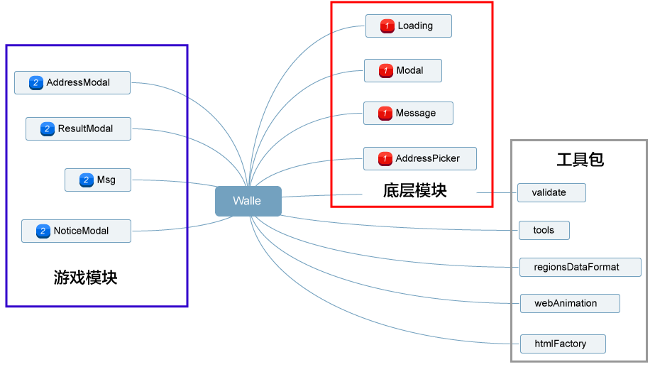

# Walle

walle瓦力，是抽奖游戏模块化的大管家，它始于抽奖但不止于抽奖，可应用到其他项目。

> 所有通用模块样式可以高度定制 属性定义参考[style](./style.md)


### 安装

```sh
npm i @byhealth/walle -S
```


### 结构




### 游戏模块 

[demo](https://by-healthfed.github.io/venom-walle/dist/)


```javascript
import {AddressModal, ResultModal, NoticeModal, Msg } from '@byhealth/walle';
```

- #### 填写收货人地址弹窗 [AddressModal](< ./AddressModal >) 

- #### 抽奖结果弹窗 [ResultModal](< ./ResultModal >)

- #### 消息弹窗 [NoticeModal](< ./NoticeModal >) 

  #### ...


### 底层模块

```javascript
import {Loading, Modal, Message, AddressPicker} from '@byhealth/walle';
```

- #### 页面加载 [Loading](<http://www.eightfeet.cn/Loading/>)

- #### 页面弹窗 [Modal](<http://www.eightfeet.cn/Modal/>)

- #### 弱提示 [Message](<http://www.eightfeet.cn/Message/>)

- #### 地址选择 [AddressPicker](<http://www.eightfeet.cn/AddressPicker/>)


### 工具包

```javascript
{
    // 表单验证
	validate: {...}
    // HTML创建dom、移除dom、创建行内样式
    htmlFactory: {
		createDom, 
		removeDom,
		inlineStyle
	},
    // 通用工具
	tools: {
		isPC,
		isObject, 
		countDown,
		dormancyFor, // Promise延时
		fixpx,
		setEmBase
	},
    // 省市区格式化
	regionsDataFormat: {
		formatWheelsData,
		getPositionByDefaultValue
	},
    //  js监听css动画
	webAnimation: {
		onceTransitionEnd,
		onceAnimationEnd
	}
}
```

